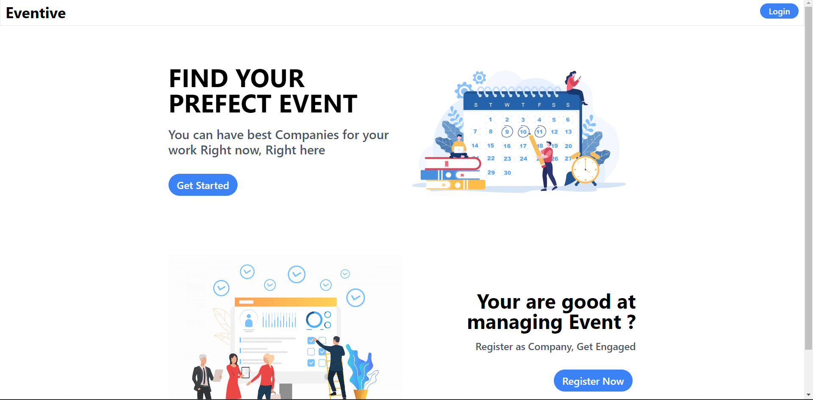
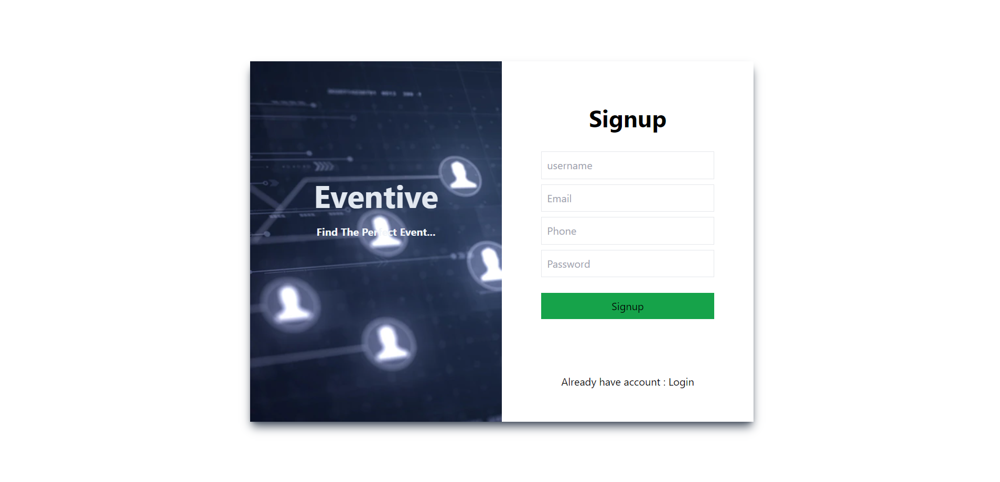
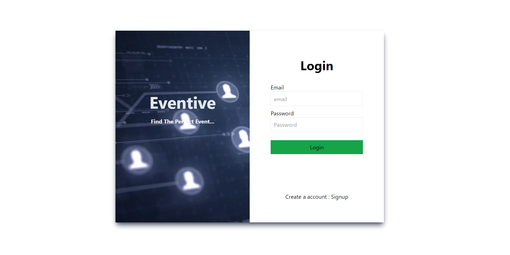
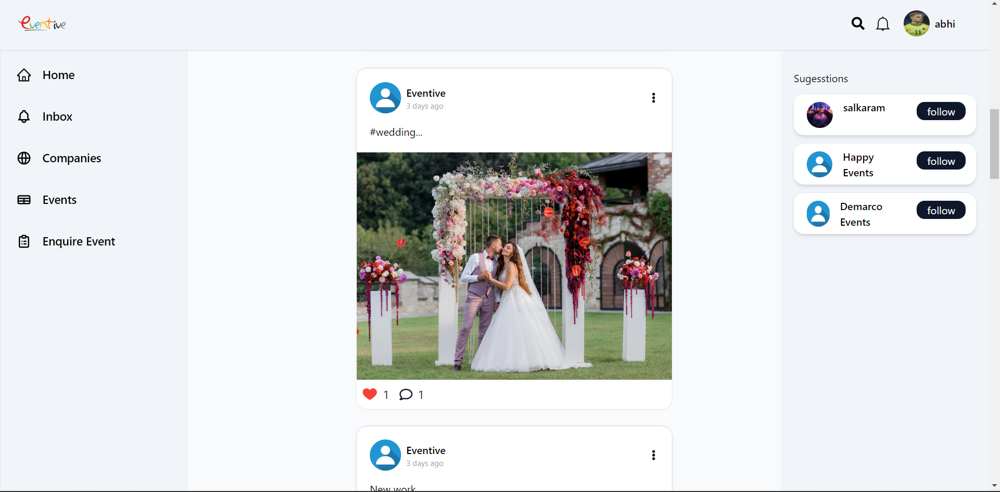
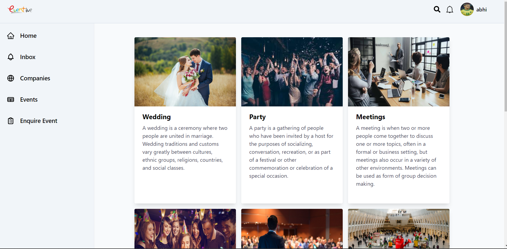
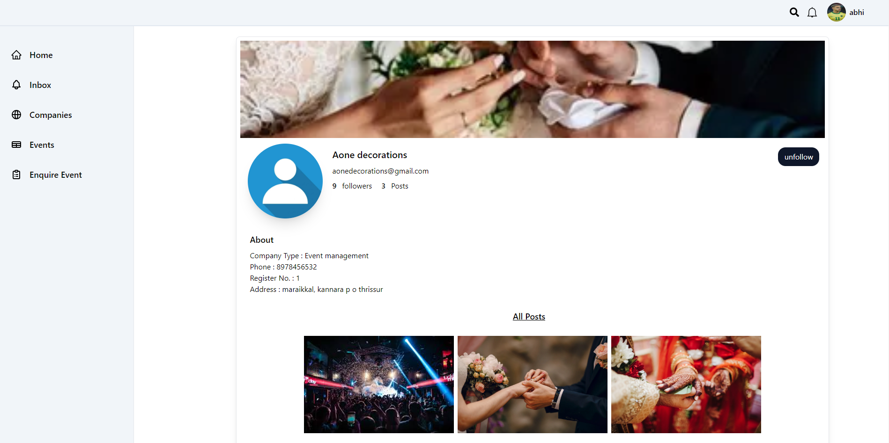

# Eventive (Event Managements)

Eventive is a Event managemet website where users and Companies can Register with OTP verification and login. Then they can access to feedpage where companies can posts their events and advertisement,that the user can like and comment the posts.company can view the other compaies posts . User can follow the companies theyy likes,enquiry about the event and then the company give a replay as quotation and after accepting the quotation of the comapany the user can chat with the company for more informations.Profile Settings for users and company. Admin can Manage POST,COMPANY and USER.

## API Reference

#### Get HomePage

http
  GET /eventive.tk

| Parameter | Type     | Description                |
| :-------- | :------- | :------------------------- |
| `api_key` | `string` | *Required*. Your API key |

#### Get Login

http
  GET /eventive.tk/login

  GET /eventive.tk/company-login

| Parameter | Type     | Description                |
| :-------- | :------- | :------------------------- |
| `api_key` | `string` | *Required*. Your API key |

#### Get feed

http
  GET /eventive.tk/posts

| Parameter | Type     | Description                |
| :-------- | :------- | :------------------------- |
| `api_key` | `string` | *Required*. Your API key |

####  Company Profile

http
  GET /eventive.tk/company-profile/${userId}

| Parameter | Type     | Description                       |
| :-------- | :------- | :-------------------------------- |
| `id`      | `string` | *Required*. Id of item to fetch |

## Run Locally

Clone the project

bash
  git clone https://github.com/Beffinyohannan/eventive-project

Go to the project directory

bash
  cd eventive-project

Install dependencies

bash
  npm install

Start the server

bash
  npm run start

## 🚀 About Me
I'm Beffin Yohannan, Passionate full stack developer...

## 🔗 Links

